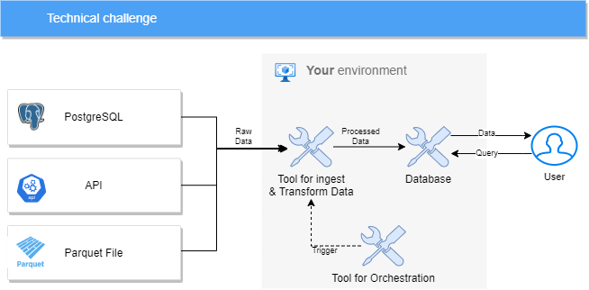
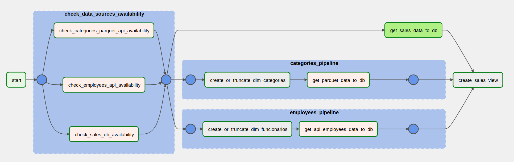

# Airflow sales pipeline

  airflow sales pipeline é uma pipeline ETL desenvolvida inteiramente em python utilizando a framework de orquestração de dados Apache Airflow 2.3.0 que coleta dados de três fontes de dados diferentes e
  as insere num Data Warehouse, a arquitetura da aplicação foi baseada no seguinte esquema:

  

  O projeto consiste em apenas uma DAG e o script de orquestração da mesma pode ser achado no caminho "dags/bix_etl/populate_sales_dw.py". segue uma imagem do DAG no Airflow UI:

  

---

### Estrutura de Pastas

    .
    ├── dags
    │     ├── bix_etl
    │          ├── functions                 # onde ficam os python callables dos PythonOperators
    │          │     ├── helpers.py
    │          │     ├── source_checks.py
    │          ├── populate_sales_dw.py      # arquivo que cria a DAG (orquestração)
    ├── include                             
    │     ├── sql                            # pasta onde se destinam os arquivos .sql utilizados
    │          ├── ..sql files                
    ├── logs                     
    ├── plugins                             # pasta destinada aos sensors e operators customizados (vazio)
    │     ├── operators
    │     ├── sensors
    ├── tests                               # pasta onde estão os testes automatizados
    │    ├── integration_tests
    │    ├── unit_tests
    │    ├── validation_tests
    │    ├── conftest.py
    ├── docker-compose.yml                  # docker-compose de desenvolvimento (usa uma imagem extendida do airflow)
    ├── docker-compose-prod.yml             # docker-compose de produção
    ├── DockerFile                          # DockerFile que cria a imagem extendida do airflow (para desenvolvimento)
    ├── setup_airflow.sh                    # instala o airflow da maquina e roda ele pela primeira vez
    ├── .gitignore
    └── README.md
